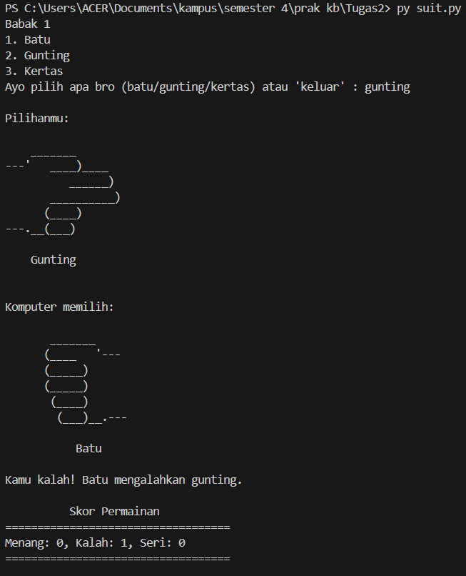

# Batu Gunting Kertas - Permainan Terminal

## 🎮 Tentang Permainan

Permainan ini adalah implementasi dari permainan klasik "Batu, Gunting, Kertas" yang dapat dimainkan di terminal menggunakan bahasa Python. Pemain akan memilih satu dari tiga opsi (batu, gunting, atau kertas), lalu komputer akan memilih secara acak. Hasil permainan ditentukan berdasarkan aturan standar:

- **Batu menang melawan Gunting**
- **Gunting menang melawan Kertas**
- **Kertas menang melawan Batu**
- Jika kedua pemain memilih hal yang sama, maka hasilnya seri.

---

## 🛠 Teknologi yang Digunakan
- **Python**: Bahasa pemrograman utama.
- **NumPy**: Digunakan untuk menyimpan dan mengelola skor permainan dengan array.
- **Random**: Untuk menghasilkan pilihan acak dari komputer.

---

## 🔥 Cara Kerja Permainan
1. Program akan menampilkan pilihan: **Batu, Gunting, atau Kertas**.
2. Pemain memasukkan pilihan mereka dalam bentuk teks (contoh: `batu`, `gunting`, atau `kertas`).
3. Komputer akan memilih secara acak dari tiga opsi yang tersedia.
4. Kedua pilihan akan ditampilkan dalam bentuk **ASCII Art** agar lebih menarik.
5. Program akan menentukan pemenang berdasarkan aturan permainan.
6. Skor akan ditampilkan setelah setiap ronde.
7. Pemain dapat terus bermain hingga mengetik `keluar` untuk mengakhiri permainan.

---

## 📌 Struktur Kode
### 1️⃣ **Pilihan dan Aturan Permainan**
Program mendefinisikan aturan dalam dictionary `choices`, yang menentukan kemenangan:
```python
choices = {
    "batu": "gunting",
    "gunting": "kertas",
    "kertas": "batu"
}
```

### 2️⃣ **ASCII Art untuk Visualisasi**
Setiap pilihan memiliki representasi ASCII Art yang berbeda untuk pemain dan komputer:
```python
ascii_art_player = {
    "batu": "ASCII Batu",
    "kertas": "ASCII Kertas",
    "gunting": "ASCII Gunting"
}
```

### 3️⃣ **Fungsi Utama**
- `get_computer_choice()`: Menghasilkan pilihan acak untuk komputer.
- `determine_winner(player, computer)`: Menentukan pemenang berdasarkan aturan permainan.
- `display_score(scores)`: Menampilkan skor kemenangan, kekalahan, dan seri.
- `main()`: Fungsi utama yang menjalankan permainan dalam loop hingga pemain keluar.

---

## 🎯 Cara Menjalankan Program
1. Pastikan Python telah terinstal di komputer Anda.
2. Simpan kode di file bernama `suit.py`.
3. Buka terminal atau command prompt dan jalankan perintah berikut:
   ```bash
   python suit.py
   ```
4. Ikuti instruksi di layar dan mainkan permainan!

---

## 🚀 Fitur yang Bisa Ditambahkan
Ingin meningkatkan permainan ini? Berikut beberapa ide:
- Tambahkan sistem **mode best-of-three** untuk menentukan pemenang dari beberapa ronde.
- Tambahkan suara atau efek animasi agar lebih interaktif.
- Gunakan **GUI dengan Tkinter** agar lebih menarik secara visual.

---

Selamat bermain! 🎉

